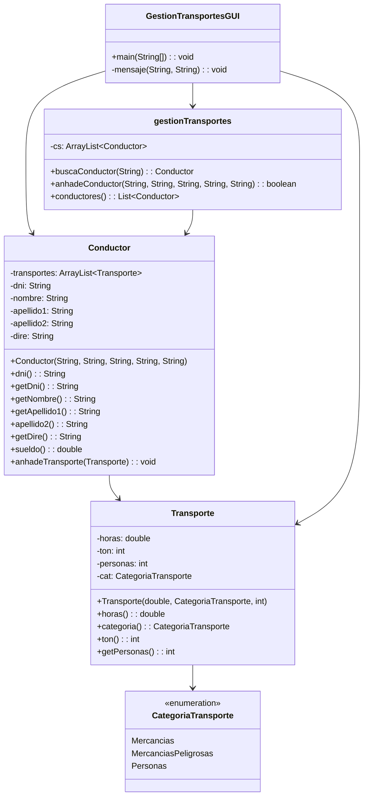
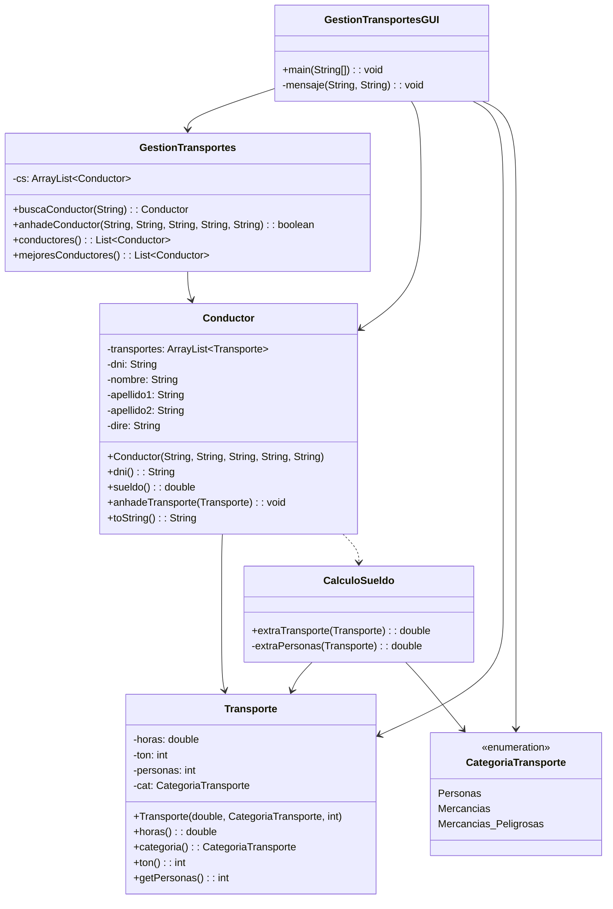

# Practica 6 - Entrega

## Contenido
- `practica6-inicial`: proyecto Maven con la version inicial.
- `practica6-final`: proyecto Maven con la version refactorizada.
- `practica6-final/target/Practica6Final-jar-with-dependencies.jar`: jar ejecutable de la version final.

## Refactorizaciones aplicadas
1. Se normalizo `CategoriaTransporte` en la version final para ajustarla al diagrama, dejando `Mercancias_Peligrosas` como valor principal.
2. Se extrajo la logica de calculo de suplementos de sueldo a `CalculoSueldo`, eliminando la rama condicional de `Conductor.sueldo`.
3. Se traslado a `GestionTransportes` la seleccion de los conductores con mejor sueldo, simplificando la GUI.
4. Se redujo la API publica de `Conductor` a lo que usa la aplicacion, usando `toString()` para la representacion textual del nombre completo.
5. Se actualizaron los tests del proyecto final para reflejar la nueva API y la nueva enumeracion.

<!-- ## Criterio de metricas
- `WMCn`: numero de constructores y metodos declarados en la clase.
- `CCOg`: numero total de puntos de decision en los metodos de la clase. Se cuenta `if`, `for`, `while` y cada `case` de un `switch`.
- `WMC`: `WMCn + CCOg`.
- `CCOgn`: numero de metodos o constructores de la clase que contienen al menos un punto de decision.
- `CBO`: numero de dependencias directas hacia clases de la aplicacion. Se listan las clases que contribuyen a ese valor.
- `DIT` y `NOC`: no hay herencia en esta aplicacion, por lo que se mantienen a 0 en todas las clases. -->

## Situacion inicial

### Metricas iniciales
| Clase | WMCn | CCOg | WMC | CCOgn | CBO | Dependencias CBO | DIT | NOC |
| --- | ---: | ---: | ---: | ---: | ---: | --- | ---: | ---: |
| `CategoriaTransporte` | 0 | 0 | 0 | 0 | 0 | - | 0 | 0 |
| `Transporte` | 5 | 1 | 6 | 1 | 1 | `CategoriaTransporte` | 0 | 0 |
| `Conductor` | 9 | 6 | 15 | 2 | 2 | `Transporte`, `CategoriaTransporte` | 0 | 0 |
| `gestionTransportes` | 3 | 3 | 6 | 2 | 1 | `Conductor` | 0 | 0 |
| `GestionTransportesGUI` | 2 | 14 | 16 | 1 | 4 | `gestionTransportes`, `Conductor`, `Transporte`, `CategoriaTransporte` | 0 | 0 |

## Situacion final

### Metricas finales
| Clase | WMCn | CCOg | WMC | CCOgn | CBO | Dependencias CBO | DIT | NOC |
| --- | ---: | ---: | ---: | ---: | ---: | --- | ---: | ---: |
| `CategoriaTransporte` | 0 | 0 | 0 | 0 | 0 | - | 0 | 0 |
| `Transporte` | 5 | 1 | 6 | 1 | 1 | `CategoriaTransporte` | 0 | 0 |
| `CalculoSueldo` | 3 | 4 | 7 | 2 | 2 | `Transporte`, `CategoriaTransporte` | 0 | 0 |
| `Conductor` | 5 | 3 | 8 | 3 | 2 | `Transporte`, `CalculoSueldo` | 0 | 0 |
| `GestionTransportes` | 4 | 6 | 10 | 3 | 1 | `Conductor` | 0 | 0 |
| `GestionTransportesGUI` | 2 | 12 | 14 | 1 | 4 | `GestionTransportes`, `Conductor`, `Transporte`, `CategoriaTransporte` | 0 | 0 |

## Analisis
La mejora no se apoya en cambiar todo el sistema, sino en sacar la complejidad de las clases principales hacia piezas mas concretas. `Conductor` pierde la rama de negocio del sueldo y pasa a delegarla a `CalculoSueldo`. La GUI deja de calcular el mejor conductor y pasa a pedirlo al gestor. Como resultado, las clases de uso directo disminuyen su complejidad ciclomatica y quedan mas centradas en una sola responsabilidad.

## Verificacion
- Se ejecuto una prueba de humo sobre el codigo final y termino correctamente con `SMOKE_OK`.
- Se ejecuto `mvn test package` en la raiz de la entrega y el build completo termino con `BUILD SUCCESS`.
- El jar ejecutable final se genero en `practica6-final/target/Practica6Final-jar-with-dependencies.jar`.

_He usado Claude AI por asistencia en este proyecto_